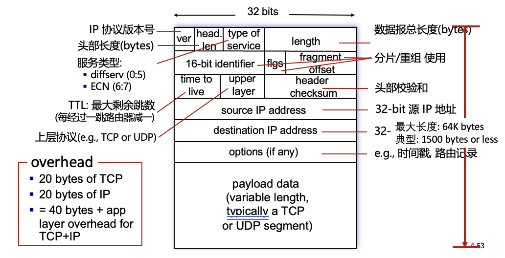

# 计算机网络H lecture 10
上次：
## 交换结构 
交换的实现，共享内存，内存问题多多
共享总线方法也会受制于总线的带宽
crossbar结构，效率高，但是因为增加的cross是$O(n^2)$增长的，所以成本很高
所以提出了优化：nxn交换机由多级小交换机组成 交换开关变成$O(n\log n)$

**加速比** 加速比 = 无交换结构的传输总延迟 / 有交换结构的传输总延迟

### 通过互联网络交换
还可以利用并行性，在入口处将数据报分片为固定长度的信元；通过互联网络交换信元，在出口处重新组装信元；
并行运用多个交换平面来拓展

### 输入端口排队
swtich fabric 交换结构也会排队（即使我们使用crossbar）

当交换结构的速率小于所有输入端口速率之和 -> 在输入端口队列处可能可能会发生排队现象 多个输入端到同一个输出端时 **输入端口排队**
所以，我们需要输入端配置缓存，当然输出端不需要（假设没有反压机制，下游不会给上游信号；当然了反压信号使得下游满了的时候可以给上游亮红灯，不会导致丢包，即为无损网络。但是这往往会导致拥塞扩散，甚至可能死锁）

除了排队延迟以及由于输入缓存溢出造成了丢包，还有可能：
Head-of-the-Line (HOL) blocking **对头阻塞**: 排在队头的数据报阻碍了队列中其它数据报的转发
例如，一个输入端口由a b两个包在排队去往d e两个输出端口，另一个端口有c 包正在前往d 就堵住了a
这时候，即使e输出端口没有堵，b包也不得不等待a

因为产生了HOL delay随load增加而成指数级增加
OutputQueue（OQ）的delay依然是在load接近100%时才趋近于正无穷
但是，InputQueue（IQ）在load达到百分之四五十时就开始急速增长了，可以证明在$2-\sqrt 2$时InputQueue就会到正无穷，即服务能力最多58%

#### 输出端口排队

那么。我们可以设计： **虚拟输出队列VOQ，使得转换为输出端口排队** 
每个输入端口的**输入队列**被分为N个逻辑队列，即VOQ virtual output queue
每个逻辑队列存储着对应输出端口的信元

所谓逻辑队列，就是其实还是每个输入端口的输入队列都是共用硬件的，则在每个时间点，N个逻辑队列中最多只有一个队列是有包的

crossbar的加速比大于等于N，则输入端不会排队，输出端会排队
加速比小于1，则输出不需要排队

当数据报从交换结构到达输出端口的速度快于链路传输速率时，就需要输出端口缓存，同样数据报会因为拥塞、缓存区没有空间等原因而被丢弃。需要一个调度算法来选择一个排队的数据报去传输（比如优先级调度–谁会获得最优的性能，网络中立原则）

**输入输出端口结合排队**
两边都放缓存
当加速比等于2，输入端基本上不太需要buffer，调度算法也不需要太复杂，是比较平衡的情况

#### 多少缓存够用
更多的缓存会增加时延 所以不是越大越好
RFC经验法则，缓存大小B应该等于平均往返时延RTT 乘以链路容量C $RTT \times C$
此外，当存在N个异步的流时，缓存大小等于$\frac{RTT \times C}{\sqrt N}$ 因为异步程度高，所以其实同一时间来的流很少，所以buffer可以小

**证明：回顾TCP congestion control 怎么确保瓶颈链路利用率100%？** 
为了避免缓存干涸（buffer underflow）：
Buffer size B >= half of the peak window size $B \ge W_{max}/2$ 确保窗口缩小时（如拥塞后），缓存足够

此外还有$\frac{(W_{max}/2)}{RTT} \ge C$ 窗口缩至一半时，其对应的传输速率（窗口 / RTT）仍不低于链路带宽 C

合并两个不等式，$B \ge RTT \times C$
缓存大小至少等于 BDP，才能完全承接一个 RTT 内链路能传输的所有数据，从硬件层面保障链路不空闲

#### 缓存管理:
丢包有多种方法：
丢弃: 当缓存区已满时要添加或丢弃哪个分组
弃尾: 丢弃到达的分组
优先级: 基于优先级丢弃或移除分组

还可以标记: 决定哪个分组打上拥塞信号的标记 (ECN, RED)

**上述都是buffer入口的管理，还可以分组调度**
分组调度: 决定下一个要通过链路传输的分组，有这几种：
1. first come, first served 即FCFS（FIFO）
2. priority 优先级调度: 到达的流量进行分类, 按照不同的等级进行排队;任意头部字段都可以用来分类
3. round robin即RR调度，server周期性、重复地扫描不同类型队列，依次从每个类型队列（如果队列不为空）里面发送一个完整的分组。不过它有公平性问题，大的文件包更多，分组数远多于小文件，所以被发的更多
4. *weighted fair queueing WFQ这也是一种轮询，是一般化的RR* (略)

**补充：网络中立性** 无阻塞 无限流 无付费优先...

## 网络层：互联网
主机、路由器中的网络层功能，包括路径选择算法（路由协议OSPF,BGP / SDN控制器），IP协议 ICMP协议

### IP
IP数据报格式

有length来应对变长payload；有分片，因为很多时候不同的网络允许的最大包大小不同
options字段可以保存ts，甚至可以指定路由

TCP最少20Byte，IP最少20Byte，所以一般认为IP包最小包大小40Byte

**IP分片和重组**
网络链路有MTU (最大传输单元) —— 链路层帧所允许携带的最大数据长度，不同的链路类型有不同的MTU
大的IP数据报在网络上被分片(fragmented)
一个数据报被分割成若干个小的数据报，有相同的ID和不同的偏移量，最后一个分片标记为0
重组 (reassembly)只在最终的目标主机进行（路由器不做重组，但是路由器可以分片）
IP头部的信息被用于标识，排序相关分片

比如400byte数据报，MTU=1500Byte
则第一片20Byte header+1480Byte data，offset=0
第二片20Byte header+1480Byte data, offset=1480/8=185
第三片20Byte header+1020Byte data, offset=2960/8=370

**IP编址**
IP 地址: 与每个主机或路由器接口相关联的32位标识符  
接口: 主机/路由器 和 物理链路的连接处 
路由器通常有多个接口
主机通常有一个或两个接口(e.g., wired Ethernet, wireless 802.11)

交换机没有ip 路由器有

**子网 subnets**
物理上不需要经过中间路由器就能相互到达的设备接口即为子网

在同一个子网内，所有设备有相同的IP地址前缀
IP 地址的结构: 
子网部分: 同一子网中的设备具有共同的高位bits
主机部分: 低位bits 

判断子网的方法:
将每个接口与其主机或路由器分离，构成一个个网络孤岛（注意：两个路由器之间的链路也算！）
每一个孤岛网络被称之为一个子网（subnet）

**IP地址分类**
A类地址，第一位是0，加上7位构成前8位，区分不同的网络，后24位区分不同的主机
B类地址，前两位10，加上14位构成16位去区分网络，后16位区分主机
C类地址，前三位110，加上21位构成24位去区分网络，后8位区分主机
D类地址，前4位1110，完全就是multicast address，这类地址专门用于 IP 组播（multicast），不分配给单个主机

**特殊IP**
子网部分，全0为本网络
主机部分，全0为本主机 0.0.0.0
主机部分，全1为广播地址，指代这个网络的所有主机
127开头的，为自环loopback，不涉及网卡

此外，在A B C类地址上各自分了一部分地址作为内网专用地址，永远不会和公用地址重复，只在局部网络有意义（也就是说路由器碰到之后会直接丢掉，因为它不可能到其他网络去）
Class A 10.0.0.0-10.255.255.255 MASK 255.0.0.0（即mask前8位）
Class B 172.16.0.0-172.31.255.255 MASK 255.255.0.0（mask前16位）
Class C 192.168.0.0-192.168.255.255 MASK  255.255.255.0（mask前24位）

**IP编址，CIDR(现代做法)**
CIDR: Classless InterDomain Routing (pronounced “cider”)  无类域间路由
地址的子网部分为任意长度
地址格式: a.b.c.d/x, x 是地址中子网部分的长度 即为 **子网掩码**

#### 如何获得IP
**主机如何在网络获取地址(地址的主机部分)**
可以在地址配置在unix中的文件中
或者，现代做法是**DHCP**(网络层协议，Dynamic Host Configuration Protocol: 动态地从服务器获取IP地址),   “plug-and-play” 即插即用
DHCP，可重新启动时，允许重新使用以前用过的IP地址，支持移动用户加入或离开该网络
实现中，每次获取的除了IP地址，还有租期，租期到期后要重新申请
    
因此，每个路由器需要一个DHCP server，为路由器连接的所有子网服务

DHCP 工作概况(下面的每个信息，都是广播出去的，因为client的IP未知):
主机广播 DHCP discover 报文
DHCP 服务器用 DHCP offer 做出响应
主机请求 IP 地址: 发送 DHCP request 报文
DHCP 服务器发送地址: DHCP ack 报文 

（后面的两步是必须的，因为如果有多个DHCP服务器则需要确认；前两步可选，因为主机可以试探性地问我是不是可以继续使用上次分配的IP，如果可以那么两次通信就够了）

另外，DHCP不仅仅返回子网中的IP地址，也可以返回第一条路由器的IP（默认网关）、DNS域名、子网掩码

**网络如何为自己获取IP地址(地址的网络部分)**
我们需要使用ISP去获得的地址块中分配一个小地址快
例如一个企业想要一段地址块，比如每个下层ISP有低12位低支配权（更高位由更高级的机构管理），可以把这一段分成8块给不同的企业

在互联网中，实际上我们使用的是层次化编址，这可以是的地址聚合（相近的公司的地址块接近）
类似于生活中的地址，你要找外地的地址，先找到大层次的地址，例如城市，之后是区，再是街道...）

之后，每一层会给上一层一个通道，让上层可以维护路由表

有一些特殊路由信息，例如Organization 1 从 Fly-By-Night-ISP 移动到 ISPs-R-Us
ISPs-R-Us 现在发布一条关于Organization 1的特殊路由信息，让上层更新路由表

ISP获得地址块是ICANN internet corporation for... 它通过几个区域注册中心分配IP，然后区域注册中心可以分配给本地注册中心。当然，它也负责DNS

*事实上，2011年最后的地址就分配完了，但是有CIDR NAT等技术让IPv4存续到现在*