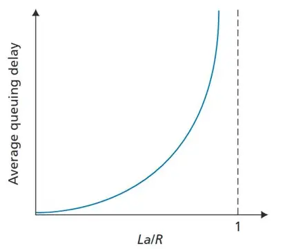

# 计算机网络 Lecture2 2025.9.16

### 分组延迟 / 丢失
buffle：FIFO的queue比较常见
丢包模式：有时丢最前面的包反而是好的，能够让丢失的信号最快传回
**分组延迟delay的四个源头：**
$d_{nodal} = d_{proc} + d_{queue} + d_{trans} + d_{prop}$
分别是：节点处理延迟 processing 小于毫秒级
排队延迟 queue 取决于拥塞程度
传输延迟 transmission $d_{trans} = \frac{L}{R}$ L分组长度 R链路传输速率
传播延迟 propagation $d_{prop} = \frac{d}{s}$ d为物理链路长度 s传播速度（光纤是光速...）

queue delay是主要变量，而且buffle不是越大越好（让发送端会无限提速，反而加大delay）
**存储转发** 每组到齐后，下一跳才开始，不然会有很多问题（是否还需要保留链路？...）

分组排队延迟：
$$流量强度 = \frac{L \cdot a}{R}$$ L 分组长度bits R链路带宽（比特传输速率） a 分组平均到达速率（每秒钟到多少个组）
大于1: buffle大 delay趋向于无穷  buffle小 丢包
趋近于1：平均排队延迟大
趋于0:平均排队延迟小

因为是柏松分布（这里有平均），所以二者有关系：

*traceroute可以发送time-to-live来探测分组、测试延迟*
*因为ipv4中ttl数据如果时间到而消失，会返回一个信号*

丢失的分组，可能会被之前的节点、源端或系统重传（当然也可能不重传）
**吞吐量**
另一个衡量网络的指标
在发送端、接受端之间传送的速率 bits/单位时间
瞬间吞吐量
平均吞吐量

吞吐量，一般由瓶颈链路：最慢的链路决定
在一个网络中，每队连接的端到端吞吐量是min($R_c, R_s, R / 用户数量$)

### 协议分层、服务
把网络流服务分层，上层依赖于下层的服务
模块化 便于更新维护
概念化 结构清晰
**分层互联网协议栈**
*在八股文中有七层协议栈，但是实际只用五层*

**TCP/IP协议**
| 协议栈 | 解释| 例子|
| - | - |-|
| 应用层|支持网络应用|http imap smtp dns|
| 传输层| 进程到进程的数据传输|tcp udp|
| 网络层| 对数据报从源到目的路由 |ip 路由协议|
| 链路层| 相邻网络节点间的数据传输 |以太网 wifi ppp|
| 物理层| 在线路上传送bits|涉及编解码等|

### 服务，分层和封装
每一层之间，各有协议去传输数据包（不过对数据包的称呼不同）
**应用层之间**，使用传输层的服务交换"报文"(message) M
**传输层之间**，使用网络层的服务将M从一个进程传输到另一个进程，把M和传输层的报头$H_t$封装在一起，创造出传输层“报文段”(segment)
**网络层之间**，使用链路层的服务，将传输层报文段$[H_t | M]$再加一个报头$H_n$，从一个主机传输到另一个，叫“数据报”(package / datagram)
**链路层之间**，把数据报和链路层报头$H_I$封装到一起，创造出链路层“帧”(frame)
**物理层之间**，就是0101等

**源端：** 报文message一直走到物理层，得到$[H_I | H_n | H _t |M]$
**交换机：** 只有链路层和物理层 得到$[H_I | H_n | H _t |M]$给出$[H_n' | H_t' | M]$
**路由器：** 有网络层 链路层 物理层 得到$[H_n' | H _t' |M]$给出$[H_I'' | H_n'' | H_t'' | M]$
**目的端：** 从物理层一直走到应用层，得到$M$

类比于跨国邮件运输，本国语言的报头在外面，里面报头英文写到慕尼黑、外面报头中文写到北京
有网络层的路由器相当于海关
有链路层的交换机是本国节点

**TCP/IP协议栈：沙漏型结构**
应用层协议多种多样（沙漏上面大头）
链路层、物理层协议也多种多样（沙漏下面大头）
中间只有TCP/IP协议等，几乎不变（传输层/网络层）是沙漏中间

由此，互联网都可以依赖于相对固定且简单的网络核心进行通信

### 网络安全
**分组嗅探 sniffing**
广播媒体是共享的，而网卡的作用就是过滤目的端ip不是你的数据
不过可以通过混杂模式记录所有经过的分组

*周五lab使用wireshark实现*
**IP哄骗 spoofing**
发送有虚假源地址的分组，让服务器发送大量数据给源地址，占用源地址的带宽

**拒绝服务攻击 Denial of Service,DoS**
伪造流量，使得资源（带宽/存储cpu）无法用于合法流量

**防御方法**
- 认证 比如蜂窝网络通过SIM卡认证，或者应用层的认证
- 保密性 在应用层、传输层加密
- 完整性检查 通过数字签名等防止篡改
- 访问限制 VPN
- 防火墙 隔离接入网和核心网的中间件middle box

### 互联网历史
60s 早期分组交换
80s 网络互联 / 新的协议
90s 商业化 Web 新应用
00s 规模化 移动互联网 云