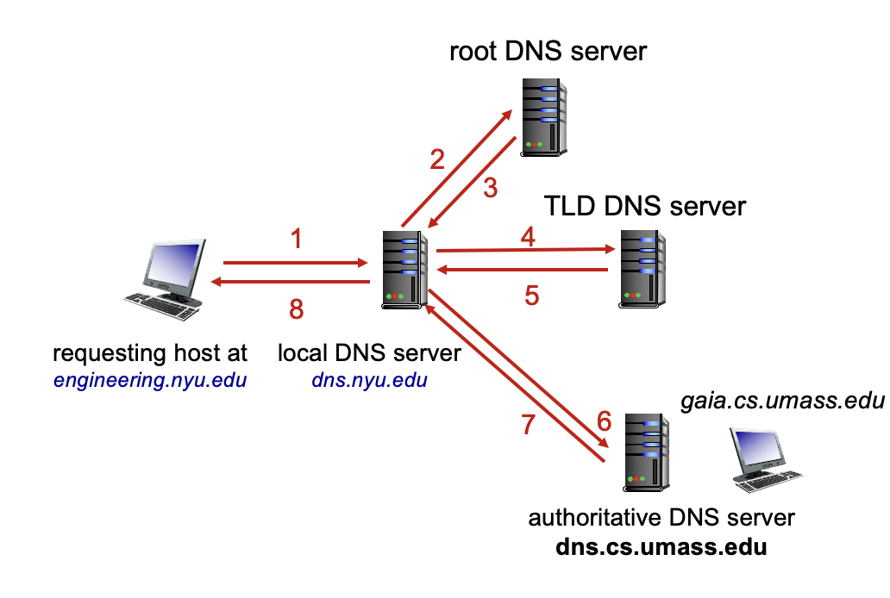
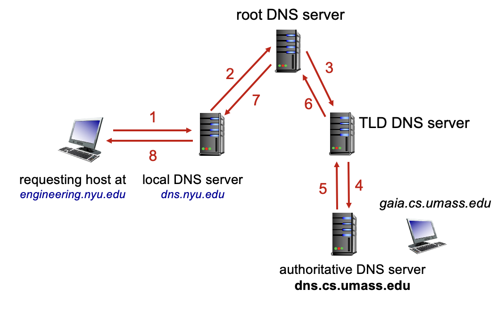

# 计算机网络
2025.9.28

### Web缓存：在不涉及源服务器的情况下满足客户请求
缓存服务器一般靠近用户
一般，这个Cache和Client非常的近，在最开始如果缓存没有命中，就作为中继器
否则，缓存接收到的对象（又作为服务器，又作为客户端）
对于缓存而言，存在Cache-Control
`Cache-Control: max-age=<seconds>` 通过这个来实现定期清空缓存
`Cache-Control:no-cache`

通过缓存服务器，不用调整接入带宽（这个成本很高）就可以一定程度降低带宽利用率，从而大大降低延迟（回忆：利用率和延迟函数是指数函数）

**浏览器缓存：条件GET**
如果浏览器有最新的缓存版本，则不发送对象，压根就没有对象传输延迟和资源占用了
具体而言，在HTTP GET请求中，发送字段`If-modified-since:<date>` 之后服务器会把这个时间和本地最新的对象的更新日期比较，就可能返回：
`HTTP response HTTP/1.0 304 Not Modified`
或者`HTTP response HTTP/1.0 200 OK <data>`

#### 上述都是HTTP/1.0 对于更新的版本：
**HTTP/1.1**
在单个TCP连接上引入多个流水线GET，在上一个GET还没收到response的时候就发送下一个
服务器按顺序（FCFS first-come-first-serve）
*当然，这会导致队头阻塞 head-of-line(HOL) blocking*
*也就是说，如果第一个对象很大，但是后面的对象很小，后面的小对象不得不等着第一个。典型现象是页面一直卡住，直到某个对象传输完之后一下子都出来了*
此外，还会有问题：丢失恢复 因为TCP是可靠协议，如果丢包会重发，那就会出现一个包丢失之后死磕这一个，后面的传输停滞

**HTTP/2**
基于HTTP/1.1，大多数方法、状态代码和大多报头相同
新增了对象优先级，也就是服务时不一定根据FCFS，而是根据优先级
而且还把对象划分为帧，帧间可能交错传输，解决了对头阻塞HOL的问题

**HTTP/3**
基于单个TCP连接的HTTP/2依然没有解决：丢包的时候死磕一个包的问题
因此，HTTP 1.1 每次会打开多个TCP
然而，TCP连接没有安全保障
因此HTTP 3 是基于UDP的，增加了安全性、实现了针对每个对象的错误恢复和拥塞控制，都是加在userspace的（Linux开发中，传输层以下都在kernel space）
UDP其实是很简单的协议，没有重传也没有拥塞控制等等，但是开发起来更自由

***
### Email SMTP IMAP
Email有三个主要组成部分
1. 用户代理user agent
2. 邮件服务器mail server
3. 简单邮件传输协议 simple mail transfer protocol: SMTP 供邮件服务器之间连接使用

用户代理：撰写、编辑、阅读邮件
每个mail server都有很多“小格子”，是每个用户的邮箱，邮件就存在服务器上
而每个mail server都只有一个发送队列（报文队列）

邮件服务器：
信箱（“小格子”）包含用户接收到的报文
报文队列包含发送（和待发）邮件报文

邮件服务器之间发送电子邮件的 SMTP 协议也是client-server CS 模型
客户端：发送邮件的服务器
服务器：接收邮件的服务器

三次握手：发送TCP连接，默认端口25
之后服务器返回OK（到此有一个RTT）
之后SMTP握手(220 helo...)
之后，传输报文，再关闭

**整个传输过程：**
client用smtp发送给自己的mail server
这个mail server向对方的mail server用smtp发送邮件
之后，对方的mail server保存邮件，直到对方登录邮箱，调用他的user agent去读取报文（这一步使用IMAP协议）
**IMAP协议：** Internet Mail Access Protocal
邮件存储在服务器上，IMAP提供检索、删除功能，也提供服务器上存储邮件的文件夹
此外，很多mail server提供基于HTTP Web的用户界面
*比IMAP更古老的，是POP3*

*和HTTP一样，SMTP也是很友好的协议，除了状态码还包含很多人类能读的文本信息*
整个过程是明文的，而且因为正文里可以写假的发送方和接收方，有安全问题

**和HTTP对比**
HTTP是客户拉pull
SMTP是客户推push（只有最后一步读邮件，是用IMAP协议拉pull）
HTTP会把每个对象封装在自己的响应报文中
SMTP是多个对象包含在一个报文中，而且是持久连接
两者都有ASCII命令和状态代码
***
### Domain Name System DNS 域名系统
互联网主机、路由器有IP地址(32bit) 用于数据报寻址
这很难记忆，因此我们人类一般记忆域名(www.***.com)
因此，需要建立两者的映射，构建了DNS
**DNS是应用层的协议** 由多个域名服务器分层实现的分布式数据库，主机、DNS 服务器通信以解析域名
为什么不放在应用层？因为这是底层功能，要放在边缘去实现，从而减少网络核心的复杂性
为什么不集中管理DNS？防止故障、流量拥塞、太遥远的数据库很慢、不可扩展（CDN服务商的访问量不可想象）而且域名在物理上分散（比如fudan.edu分散在上海，thu分散在北京）

DNS服务器建立主机名到IP地址的转换
实际上，主机有别名 比如www.baidu.com是别名，实际上它有一个非常复杂的正名
而且网页服务器、邮件服务器等等...往往看上去比如都是fudan.edu.cn，但是实际上IP地址完全不同
甚至有可能返回多个IP地址，比如www.baidu.com就有多个服务器
这里，就可以做负载均衡，比如对于不同的用户，返回不同的服务器IP，让流量均摊

对于DNS，读比写多得多，而且速度、安全性要求很高

**分别分为：根服务器；顶级域服务器；权威服务器**
什么是权威服务器？就是自己的域名自己管，比如yahoo.com的域名都归雅虎公司管；

可见，根服务器是极其重要的，一般使用DNSSEC提供安全性验证
全球 13 个逻辑根域名 "服务器"，每个 "服务器 "会被复制多次

**Top-Level Domain (TLD) 顶级域名服务器:**
负责 .com、.org、.net、.edu、.aero、.jobs、.museums 和所有顶级国家域，如：.cn、.uk、.fr、.ca、.jp

**权威DNS服务器：**
组织自己的 DNS 服务器，为组织命名的主机提供权威的主机名到 IP 映射
可由机构或服务提供商维护

**本地 DNS 服务器** WI-FI服务器等等，并不严格属于层次结构
它有缓存 如果没有缓存命中，它代你去查DNS
本地 DNS 服务器返回应答：
从其本地缓存中的最新名称到地址转换对（可能已过时）
将请求转发到 DNS 层次结构中进行解析

#### 迭代查询
被联系的服务器回复，提供要联系的服务器名称，可扩展性好

#### 递归查询
将域名解析的负担放在所联系的名称服务器上，但是层次结构的上层负担沉重

**缓存DNS**
任何域名服务器学习到映射，就会缓存
每个缓存包含一个TTL(time to live)信息，到期后就消失
*有时TTL到期之前，服务器的IP可能就已经改变，在这几分钟可能服务就中断，因此只能说DNS是尽力而为*

**DNS记录**
DNS：存储资源记录（RR）的分布式数据库 RR的格式：（name, value, type, ttl）
`type=A` 则name为主机名，value为IP地址
`type-NS` 则name 是域 （例如 foo. com）；value 是该域的权威域名服务器的主机名
因为`foo.com`可能是主机名，也可能是域名，因此需要用type来区分
`type=CNAME` 则name 是 “正式”（真实）名称的别名
www.\*** .com 实际上是servereast.backup2. \***.com；value 是正式名称
`type=MX`则value是与 name 关联的 SMTP 邮件服务器名称

同一个`fudan.edu.cn`，它可能是邮箱，可能是DNS服务器，可能是主机，也肯格式别名

DNS查询和回复报文有相同格式
**报文首部：**
identification识别码来让查询和回复对应
flags 每一位都有信息，比如查询还是回复 是否希望递归 是否权威性（不然的话可能是缓存）
一个报文可以携带多个请求，可以有多个查询的域名
对于每个请求(question) 包含不同的域名等
同理，一个回复的报文可以回复多个请求，每个answer都包含RR（资源存储记录）
最后有附加信息

对于开设一个服务器：
1. 在 DNS 注册商处注册名称 
2. 提供权威名称服务器的域名和IP地址；注册商将NS、A记录插入 .com 的TLD服务器（顶级域名服务器）
3. 在本地创建权威服务器，IP 地址为你的IP
4. 最后，在权威服务器下面保存真正运行服务的服务器（当然，权威服务器和这个可以是同一个服务器，运行两个程序）

**DNS安全**
DDoS攻击：用流量轰炸根服务器至今未成功；轰炸TLD服务器或者权威服务器就很危险了
哄骗攻击：拦截DNS查询，返回虚假回复，会让DNS缓存中毒

