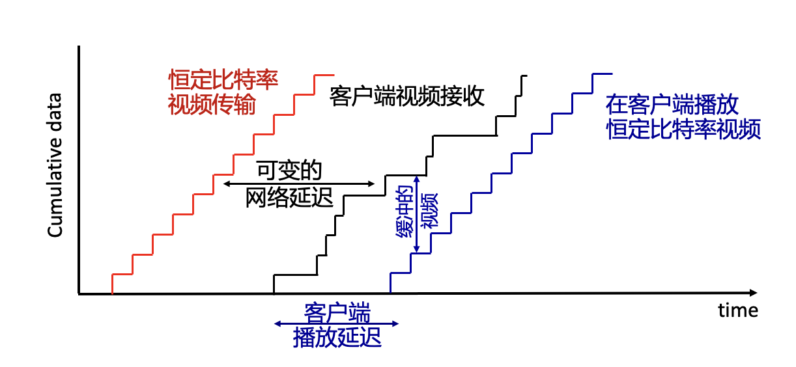

# 计算机网络 Lecture 5
## 2025.9.30

## P2P结构（peer 2 peer）
1. 没有一直在运行的服务器
2. 任意端系统之间可以直接通信
3. 端系统向其他端系统请求服务，并向其他端系统提供服务作为回报
4. 自扩展性 – 新的端系统带来新的服务能力，当然也带来新的请求
5. 端系统间歇连接并且可以改变IP地址（管理困难）
应用例：bittorrent

**文件分发给N个对等服务器**
**CS架构：**
服务器传输：必须依次发送（上传）N 份文件副本
每个客户端必须下载
因此，总时间
$$D_{c-s} \ge max \{\frac{NF}{u_ss} , \frac{F}{d_{min}}\} $$
*线性的*
**P2P架构：**
服务器传输：必须上传至少一份副本
客户端：每个客户端必须下载文件副本(总计必须下载 NF 位，但是各个客户端从不同地方同时下载)，每个客户端下载一部分，之后互相交换 

$$D_{P2P} > \max\left\{ \frac{F}{u_s} , \frac{F}{d_{\text{min}}} , \frac{NF}{u_s + \sum{u_i}} \right\}$$
*分发时间会收敛*

**P2P文件分发：BitTorrent**
文件被分成 256Kb 的文件块
洪流中的对等方发送/接收文件块
洪流（torrent）：交换大块文件的对等群组

其实还是有类似于server的东西存在，但是它不负责传输，只负责管理
即为跟踪器（tracker）:跟踪参与洪流的对等方

某个节点上线之后，从tracker中获取对等方列表，并开始在洪流中与对等方交换文件块

**对等方加入洪流： **
初始没有文件块，但会逐渐从其他对等方处积累文件块
向跟踪器注册以获取对等方列表，与对等方子集（"邻居"）连接 *因为不可能和网络中每个节点建立连接*
对等方可能会更换与之交换数据块的对等方
**流失：**对等方可能来来去去
一旦对等方拥有整个文件，它可能（自私地）离开或（利他主义地）留在洪流中。因此，需要定期向每个对等方连接，索取对方拥有的文件块列表

**请求文件块：**
在任何时候，不同的对等点都拥有不同的文件块子集
Alice 定期向每个对等方索取它们拥有的文件块列表
Alice 向对等方请求缺失的文件块，**最稀有的优先**

**发送文件块：投桃报李 tit-for-tat**
Alice向4个对等方发送文件块（哪4个？向Alice发送数据速率最快的4个）
其他对等方被 Alice 阻塞（不会接收到来自 Alice 的文件块）
每 10 秒重新评估前 4 名
每 30 秒：随机选择另一个对等方，开始发送文件块去“乐观地取消阻塞（疏通）”该对等方
新选择的对等方可能会加入前 4 名

因此：上传越快，下载越快
***
## 流媒体 (Video Streaming) 和内容分发网络 (Content Distribution Networks)
可以分为两类，On demand和实时

流视频流量：互联网带宽的主要消费者，挑战在于巨大的规模和用户的异质性（不同用户能力不同）
因此，需要分布式的应用级基础设施（CDN：应用层设施）

多媒体：视频 **需要编码压缩（CBR constant-bit-rate vs VBR:variable）**
CBR存在是因为带宽通常不变：不卡但是有时候模糊，一般融媒体现在主流是CBR

空间编码示例：
不发送 N 个相同颜色的值（均为紫色），而只发送两个值：颜色值（紫色）和重复值的数量 (N)
时间编码示例：
不在第 i+1 帧发送完整帧，只发送与第 i 帧的差值

**流式存储视频** ：就是服务器存储视频然后传输给用户
服务器到客户端的带宽可能因拥塞而降低、可能丢包...
*所谓流：客户端播放视频的早期部分，而服务器仍在发送视频的后期部分*

因此需要：客户端缓冲和播放延迟：补偿网络附加延迟、延迟抖动

为防止缓存区溢出overflow，传输比特率不能太高
如果缓存区干枯endflow，就会卡

### 流媒体主流的协议：DASH: Dynamic, Adaptive Streaming over HTTP
本质是在应用层的HTTP上的协议，也算应用层协议
**服务器：**
将视频文件分成多个块
每个块以多种不同的速率编码
不同的速率编码存储在不同的文件中
在不同的 CDN 节点复制文件
清单文件：提供不同块的 URL

**客户端：**
定期估算服务器到客户端的带宽
咨询清单，每次请求一个数据块
根据当前带宽选择可持续的最大编码率
可在不同时间点从不同服务器（根据当时可用带宽）选择不同的编码率

也就是说，何时请求分块（以免出现缓冲区饥饿或溢出现象）；请求何种编码率（当带宽更宽时，质量更高）；向何处请求分块（可向离客户端 “近 ”或可用带宽高的 URL 服务器请求分块）都是**由客户端决定**

**流视频 = 编码 + DASH + 播放缓冲**

***
### Content distribution networks (CDNs)
我们想将内容（从数百万部视频中挑选出来），同时流式传输给数十万用户
于是，最好的方式是：
**在多个地理上分布式的站点存储/提供多份视频副本（CDN）**
进一步，CDN有两个策略：
enter deep：将 CDN 服务器深入到许多接入网络中，比较接近用户
bring home: 将数量更少（10余个）的更大集群放置在靠近接入网的POP（Point of Presence，常为城市服务商的大机房）中

**OTT: “over the top”** 在互联网之上再加一层服务，是利用互联网
OTT 的挑战：从 “边缘 ”应对拥塞的互联网
将哪些内容放到哪个 CDN 节点？
从哪个 CDN 节点检索内容？以何种速率检索？
***
## UDP、TCP套接字编程
两种传输服务的两种套接字类型：
UDP：不可靠的数据报
TCP：可靠、面向字节流

**UDP**
客户端和服务器之间没有 "连接" 
发送数据前不握手
发送方为每个数据包明确附加 IP 目标地址和端口号
接收方从收到的数据包中提取发送方 IP 地址和端口号

创建套接字：serverSocket = socket(AF_INET,SOCK_DGRAM)
*AF_INET: address family, inet -> ipv4*
对于UDP，如果发送ABC，有可能返回BC（丢包） 有可能返回BCA（因为每个包可能路径不同）
**TCP** *流式的、安全的管道*
客户端必须联系服务器
服务器进程必须首先运行
服务器必须已创建欢迎客户端联系的套接字（门）
客户端通过以下方式联系服务器：
创建 TCP 套接字，指定服务器进程的 IP 地址和端口号
客户端创建套接字时：客户端 TCP 与服务器 TCP 建立连接
服务器 TCP 为服务器进程创建新的套接字，以便与特定客户端通信

