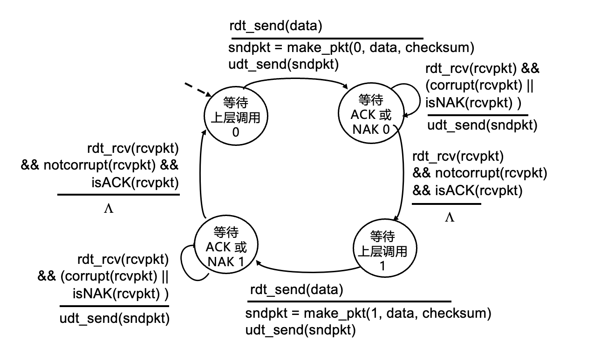

# 计算机网络（H） lecture 6

## 传输层 chpt.3
> summary：原理：多路复用解服用... / UDP TCP / 拥塞控制
>
> 

传输层：在应用程序之间提供逻辑通信
在端系统中：
发送方通过传输层协议把应用层报文分城报文段(64k byte)，再传递给网络层
接收端通过传输层协议吧报文段组合成报文，再传递给应用层

**传输层：进程间的通信**
依赖网络层的服务（延迟、带宽）
增强网络层服务（可靠传输、数据加密）有时候邮局并不可靠，但是传输层协议可以检查是否丢包并要求重传等等
**网络层：主机间的通信**
类似于：网络层是邮局，把报文从ip传到ip（从是家庭门牌号到另一个门牌号）传输层负责把信件分发给某个家庭成员（进程）

**传输层发送方：** 确定报文段首部字段值，创建报文段，传给ip
**传输层接收放：** 从ip接收报文，提取首部值，提取应用层报文，并用过套接字socket把报文 **解复用** 到应用程序

**TCP: Transmission Control Protocol 传输控制协议**
可靠的、保序的传输
拥塞控制
流量控制
建立连接
**UDP: User Datagram Protocol 用户数据报协议**
不可靠、不保序的传输
不加修饰地扩展 “尽力而为 ”的 IP（一个报文来了，就尽力传它，不会怎么进行控制）
i.e 当食物足够，就不会约定今天要吃多少饭...当带宽足够，就不太需要各种控制

**TCP/UDP都无法提供的服务：**
延迟保证
带宽保证

***
### 多路复用和解服用
所谓复用，类似于多个支路汇入主路
所谓解复用，类似于指路牌、分流等等

**发送方复用** 处理来自多个套接字socket（它们来自不同应用）的数据，添加传输层首部（即端口，随后用于解复用）
**接收方解复用** 使用首部信息将接收到的报文段传送到正确的套接字

#### 解复用的原理：
主机接收 IP 数据报
每个数据报都有源 IP 地址和目的 IP 地址
每个数据报携带一个传输层报文段
每个报文段都有 **源端口号和目的端口号**
主机使用 IP 地址和端口号将报文段导向合适的套接字

创建套接字时，必须**指定主机-本地端口号**

#### UDP解复用
在创建要发送到 UDP 套接字的数据报时，必须**指定目的 IP 地址, 目的端口号**
当接收主机收到 UDP 报文段时：查报文段中的目的端口号，将 UDP 报文段导向对应该端口号的套接字

**用UDP时，**源 IP 地址和/或源端口号不同，但是只要目的端口相同，则数据报会被导向接收主机的相同套接字

#### TCP解复用
TCP 套接字由四元组标识：
源 IP 地址
源端口号
目的 IP 地址
目的端口号
只有四元组**全都对应上**，接收器才会使用全部4个值将报文段导向合适的套接字
服务器会对多个TCP套接字并发地把每个套接字与不同的连接客户端相关联
**TCP是面向连接的，因此需要保证两个主机上的进程互相对应能单独链接上**

例如，很巧合的，两个主机a b恰好是用了同一个端口port去传输给同一个主机c 但是因为a b的ip不同，c在解复用时会把他们复用到不同套接字（**认为这两个是不同的连接**）

事实上，**复用/解复用在所有层发生**
比如网络层也在解复用，它会把流拆分成tcp udp

***
### UDP User Datagram Protocal
*不加修饰，尽力而为*
UDP 报文段可能：丢失 / 无序传输到应用程序
**UDP是无连接的：**
UDP 发送方和接收方之间不握手
每个 UDP 报文段独立于其他报文段处理，互相之间不影响（比如不会考虑先后...）
**UDP的好处：**
1. 无需建立连接（连接可能会增加 RTT 时延，比如DNS，你不希望只是查询一个ip就需要很长的时延）
2. 简单：发送方和接收方均无连接状态，不需要提供状态机存储等资源
3. 首部小 8b
4. 无拥塞控制，可以随心所欲地快速传输，面对拥塞也能正常工作

因为这些好处，UDP应用于：
1. 流媒体应用程序（可容忍丢失，对速率敏感）
2. DNS
3. SNMP
4. HTTP/3（通过 UDP 进行可靠传输的方法。思路是在应用层增加所需的可靠性和在应用层增加拥塞控制。可以自己定制）

#### UDP具体细节：
发送方：接收应用层消息，确定UDP首部的字段值，创建UDP报文段并向IP传递
接收方：从IP接受报文段，检查UDP首部（校验和），提取应用层信息，通过socket将消息解复用至应用程序
**UDP首部：**

1. 源端口号、目的端口号 ，共32bits，各16bits 因此端口号最大65535
2. 长度、校验和， 共32bits，以byte为单位的UDP报文段长度（包括首部），一般最大64K byte一个段
   校验和（报文段内容的整体视为16位整数序列，之后相加，如果进位则回滚：将最高位的进位加回来。校验码为和的补码）
   **校验内容+校验和=1111111111111111（全1） 通过校验**
   反码算术和**能检测出所有奇数个比特错误和大多数偶数个比特错误**
   发现有错误，则positive 它没有假阳性，只要校验和出错就一定有问题。但是有可能漏检。
3. 之后就是负载（应用数据）

***
### 可靠传输
我们希望在发送进程和接收进程中创建一个可靠信道
可靠数据传输协议的复杂性（在很大程度上）取决于 **（现实中）不可靠信道** 的特性（数据丢失、损坏、乱序等）
具体难点在于：我们需要维护状态（对方是否接收到等等），但是维护状态本身又靠报文沟通，这又有可能中间出错（比如无法判断没有回复是因为包没发到，还是对方回复的收到信息丢了）
**Reliable data transfer protocol(rdt)** 大致思路就是通过这个协议（可靠传输协议）加上一些报头去保证可靠传输

**如何设计可靠数据传输协议？**
不失一般性的，考虑单项数据传输，控制信息双向流动
**rdt1.0**
维护自己的状态。对于事件，执行状态转换（其实就是状态机）
如果下层的信道绝对可靠：发送方和接收方有独立的 FSM（有限状态机finite state machine）
发送方向底层信道发送数据，接收方从底层通道读取数据
**rdt2.0**
如果信道有比特错误：通过校验和来检测比特错误（实际上，每一层都有类似checksum的校验，基本能查大多数错误）
从错误中恢复的方法：通过数据信道传输确认(ACK) / 负确认(NAK) 如果发送方收到NAK，则重传（停等，发送方发送后等待信息） 
FSM需要增加校验和方法、接收方回应等。

**问题在于，如果ACK/NAK被破坏呢**

得到了 **rdt2.1** FSM成一个环
假设ACK / NAK也需要经过checksum检查。如果察出来它们也有错，直接默认NAK，重传
而且，不能简单地直接去重传，会重复，同一个包出现两次也会有问题的
因此，发送方在每个分组上添加序列号，接收方丢弃（不向上层传递）重复的分组，同时重发上次的ACK（因为都重发可能意味着ACK没有传送到，发送方以为是NCK）
实际上两个序列号（0，1）就够了。因为停等协议，每个分组发完了发送方会等的。
因此只需要标注：是否为预期分组即可。发送方首次发送分组时用序列号 0，收到 ACK 后，下一个分组用序列号 1。由此接收方始终能通过序列号判断是否为期望的下一个分组
当然了，接收方无法知道其最后一次 ACK/NAK 是否被发送方正确地接收（总归要停止的，没有所谓的确认的确认）

**rdt2.2**（TCP使用的）
无NAK协议
接收方不发送NAK，而是对收到的最后一个正确分组发送 **带分组序列号的ACK**
发送方的重复ACK会导致与NAK相同的操作：重新发送当前分组
期望1时收到序列号0或者重复，则不更新期望序列

由此，可以通过发送方检查收到的包来实现重传
比如发送pkt0成功，但是第一个ACK0出错到读不出来。反正都出错了，发送方自然会重传pkt0
接收端准备收pkt1时得到pkt0，回复ack0。对于接收方，这是它第一次收到ack0，进一步传pkt1...

**rdt3.0**
假设底层信道，不仅会有比特错误，也会丢失分组（数据、ACK都会丢）
怎么解决丢包？**超时**
发送方为ACK等待合理的时间
如果在这段时间内没有收到ACK，则重传。那发重复了怎么办？
之前的分组序列号，已经完美解决了重复传输的问题，所以无需担心

*如图，只需在FSM里增加一个timer即可*

