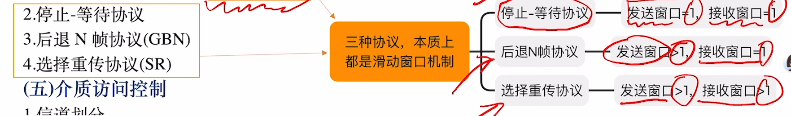
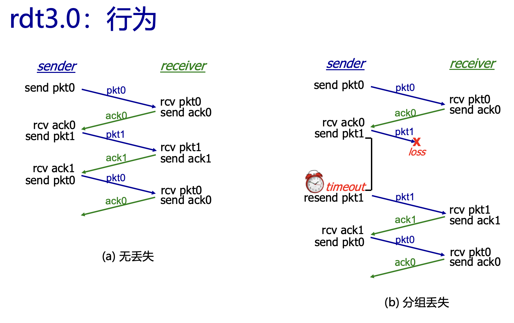
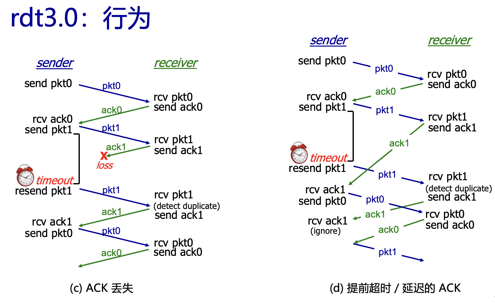
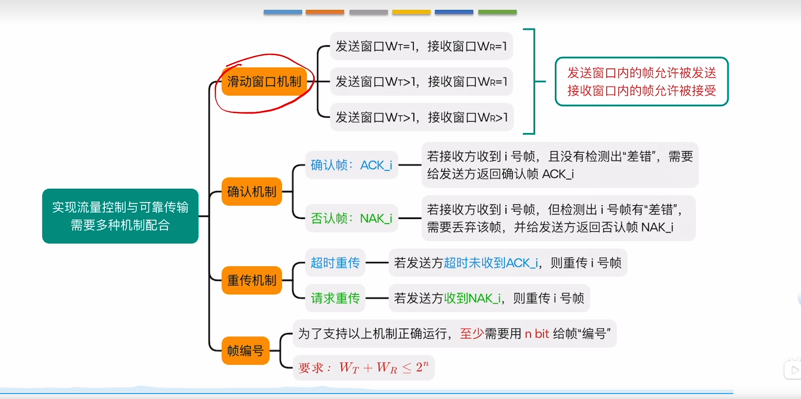
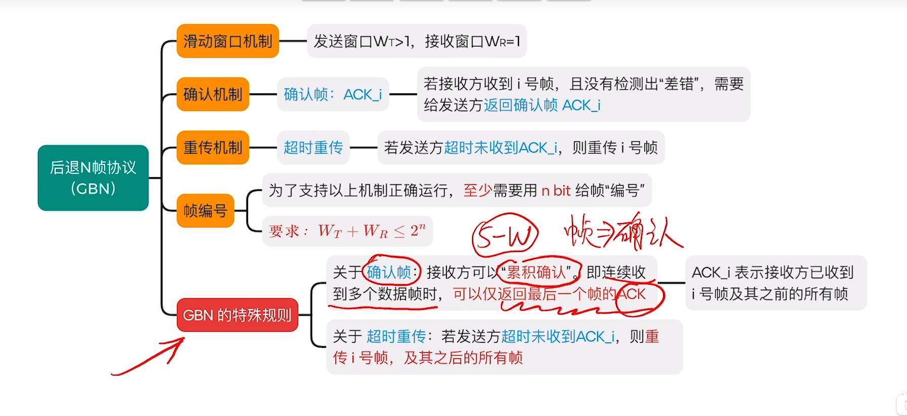
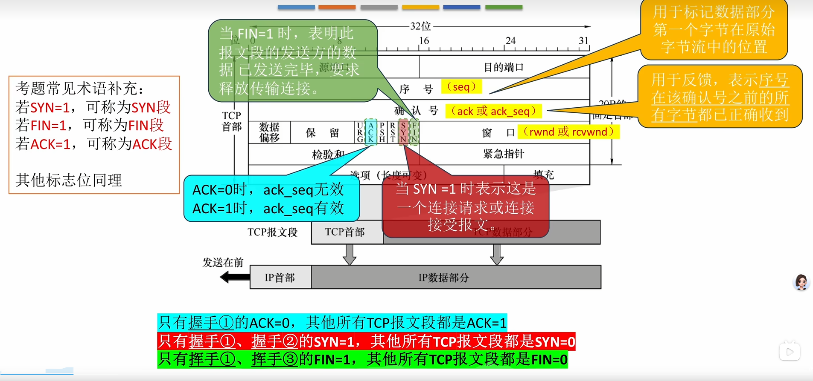
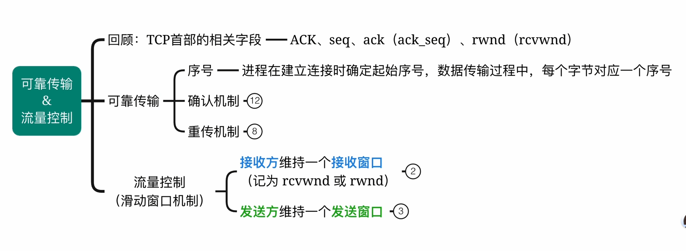
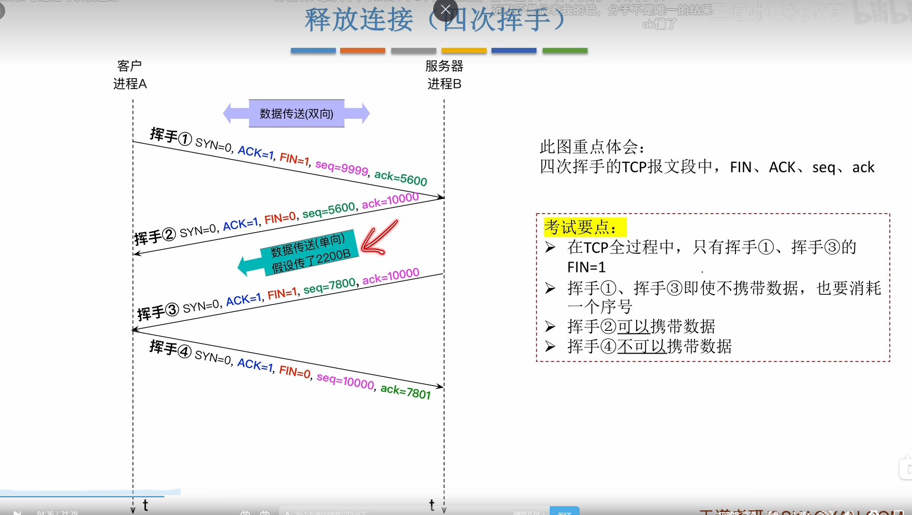

# 计算机网络(H) 25.10.21 三种可靠协议实现方法+TCP

## 上节：rdt Reliable data transfer protocol

**rdt3.0**：新的信道假设：底层信道也会丢失分组
这时候，校验和，序列号(0 1)，ACK不足够，还需要一个 **timer**
对于发送方，如果收到一个不对的ACK（无论是读取不出来，还是发现发送pkt0收到ack1）则需要重传，要么不管等到timer到时再传，要么立即重传同时reset timer

eg 人体冷冻的timer 必须要设

在这里，使用的是：收到不想要的ACK时，什么也不干，而是等待timer（rdt2.0会立即重传，rdt3.0当然也可以立即重传，但是我们在此使用的实现是等待timer，这样实现会更简单，不需要reset timer的工作）

### rdt3.0 停等协议的性能分析：
定义利用率$U_{serder}$：发送方忙于发送的时间比例（100% - 等待的时间比例）
从第一个bit开始传输，到最后一个bit传输完成，这一段时间是发送时间
而传播时间，接收方收到第一个bit到收到最后一个bit然后返回ACK（假设接收方处理时间不计），直到ACK传回到发送方，为 **一个RTT**
简单计算，利用率万分之几级别，性能非常差！也就是这个协议使得底层基础设施（通道）无法发挥性能
$$
U=\frac{L/R}{L/R+RTT}
$$

### rdt3.0 流水化协议操作
为优化性能，发送方允许多个“飞行中”、尚未确认的数据包存在
为此，我们需要更大的序列号范围，也需要发送方、接收方的缓冲区（目前正在飞行的几个包，发送方需要buffer他们以防重传；接收方也需要buffer以备他们有问题后要求重传）
$$
U_{senfer}=\frac{n * L/R}{RTT + l/R}
$$
n为流水线深度。

当一个包丢了，可以使用：
#### Go-Back-N(GBN)方法
**对于发送方：**
滑动窗口大小为N：允许最多有N个发送了但是没有被ACK的分组
（当然，这N个包可能发了一部分，还有一部分还没发，甚至可能应用层还没给出）

因此，我们重新修改ACK为累积ACK，每次ACK序列号为n及之前所有的包。这样，ACK包丢失问题不大
发送方每次收到ACK(n)，则滑动窗口从[n, n+N]到[n+1, n+1+N]

同时，发送方为最老的尚未被ACK的分组 **维护一个timer(n)** 
如果timeout(n) 重传窗口中序列号为n以及之前的所有分组（就是窗口中已经发送了的分组）

比如最开始，闹钟挂在pkt0上，收到ack0之后，把闹钟挂在pkt1上。问题：我们没有维护pkt1什么时候发送的，所以，我们直接从当前的时间开始计时。这时候，pkt1已经发送了有一会了，但是问题不大，就是系统多等一会而已

这个timer设多少？一般tcp使用：两三百ms（数据中心内部可能微秒级别）

**对于GBN的接受方：**
总是为目前收到的、**有序** 且序列号最高的分组发送ACK（比如中间有包丢了，存在气泡，则发气泡前一个的ACK）
同时维护一个 **rev_base** 记录ACK的最高序列的下一个，即 **下一个等待被接收的包**

当然了，比如收到了1 2 4而没有收到3，可以把4进buffer，也可以丢掉，这部分tcp没有定义，由程序员自己决定

有没有方法在timeout之前，就确定丢包？重复收到多个ack1 ack1...就能确定pkt2丢包了 这就是 **快重传** 是GBN的优化

#### 选择重传方法 Selective Repeat SR
性能比GBN更好
在允许多个分组未确认的同时，接收方**单独ACK**所有被正确接收的包
发送方同样要维护滑动窗口，但是不用累积ACK，而是**为每个未被ACK的分组（概念上）维护timer** 超时重发单个分组

**发送方：**
从上层收到数据：如果下一个可用序列号在窗口中，发送分组
timeout(n):重传分组 n，重启计时器
ACK(n) 在 [sendbase,sendbase+N-1]中：将分组 n 标记为已收到
如果 n 是最小的未被 ACK 的分组，将窗口 base 向前移动到下一个未被 ACK 的序列号（可能会滑动一大块！）

**接收方：**
收到在 [rcvbase, rcvbase+N-1] 中的分组 n（这是我们要的分组）：
发送 ACK(n)
如果是乱序：缓存
如果是有序：（和其他被缓存的有序分组一起）传递到上层，将窗口 base 向前移动到下一个尚未收到的分组
收到在 [rcvbase-N, rcvbase-1] 中的分组 n（即在窗口之外的包，说明之前的ACK丢了）：发送 ACK(n)
否则： 忽略
**SR：序列号数量必须是窗口大小的两倍，不然如果接收方收到了0 1 2 3，返回ACK0 1 2 3但是ACK全丢了，之后它又收到一个0会有问题：重传的是哪一个0？**

和GBN的区别主要就是ACK
SR虽然性能好，但是有可能因为ACK丢了而不断重传，而GBN 这个ACK丢了，下一个ACK能覆盖掉它
而且，SR因为接收方也会维护滑动窗口，有可能两者的窗口对不上
具体而言，假设窗口大小为2，则序列号为0 1 2 3
也就是说我们是在0 1 2 3 0 1 2 3...上维护滑动窗口
相对的，GBN对资源的要求也少，不用维护那么多timer，但是出错时回退N步代价太大

**实际上TCP是二者的结合和改进**
延迟大 / 带宽大时，会有更多包同时在空中，窗口会比较大，用SR，不然重传N个代价太大了；延迟小 / 带宽小，用GBN
丢包率高时，用SR；丢包率低时，用GBN，因为SR实现更复杂

***
## 面向连接的传输：TCP
点对点 可靠有序
全双工
累积ack
流水线：有滑动窗口 拥塞控制和流量控制
面向连接（握手）
流量受控：发送方不会淹没接收方

### 1.	TCP报文段结构

|<----32 bit---->|
源端口 ｜ 目的端口
序列号
确认号：期望下次收到的 TCP 数据段的第一个字节的序号
TCP首部长度 预留位 C R U A P R S F 接收窗口 *A 位标识这是否是ACK包;C, E: 拥塞通知;RST, SYN, FIN: 连接管理*

\ | Urg数据指针
选项
应用数据

### 2.	TCP的可靠数据传输
#### TCP序列号，ACK 传输时的选取
**序列号：发送方使用**
报文段数据中第一个字节的字节流“编号”，即为seq编号
**确认号：接收方使用**
预期对方发出的下一个字节的序列号 需要首部中A为1
累积ACK
TCP规范没有说明接收方乱序报文段，由实现者决定

**超时：**
估算 RTT，进而更好地设置timer的时间
SampleRTT:测量从报文段传输到收到 ACK 的时间，忽略重传
取最近几次测量的平均值，得到EstimatedRTT *指数加权移动平均*
$$
EstimatedRTT = (1- \alpha )*EstimatedRTT + \alpha *SampleRTT
$$
alpha经常取0.125

因为RTT有变化，所以还需要加上一些允许的延迟4*DevRTT：
$$
TimeoutInterval = EstimatedRTT + 4*DevRTT
$$
其中DevRTT是SampleRTT和EstimatedRTT的偏差
$DevRTT = (1-\beta)*DevRTT + \beta*|SampleRTT-EstimatedRTT|$ 

beta常取0.25

*实际上通常是一个写死的值，而不是计算的值，这只是理论上的best practice*

**TCP 发送方：**
从应用程序接收到数据后，用序列号创建报文段（序列号是报文中第一个数据字节在字节流中的编号）；如果计时器现在没有运行，启动计时器：计时器是最老的未被 ACK 的报文段的过期时间间隔： TimeOutInterval 

如果超时：重传导致超时的报文段，重启计时器
如果收到ACK：如果 ACK 确认了之前未被 ACK 的分段，更新已知的 ACK；如果仍有未被 ACK 的报文段，则启动计时器

**TCP 接收方：**

* 如果接收方预期序列号之前的所有数据都ACK：delay ACK：比如收到一个报文段后，等500ms，**如果没有下一个报文段则发送ACK**
  *优化：比如接收方收到 0-8、9-17 两个连续报文段；无需等待，直接发送 ACK=18*

* 接收重复数据时，比如已确认 0-100，又收到 50-80，重发一次之前的确认号（即确认号 = 101）

* 如果接收方发现乱序到达时发现有气泡：立即发送duplicate ACK 说明下一个预期字节的序列号（接收方已收 0-8、22-35，却先收到 36-44（中间 9-21 为 “气泡”）；立即发送 ACK=9（重复之前的预期序号））

* 如果收到的包填补了间隙，立即发送ACK，发送的ACK是下一个预期的序列（比如，已经收到0-8 22-35，这时候收到9-21，发送ACK36）

* 如果接收方自己有数据要发，直接**捎带确认**：将 ACK 信息（ACK=1 + 确认号）合并到自身要发送的报文段中
  **TCP发送方会等待3次冗余ACK，一共4个，才不等timer而是直接判断丢包进而重传**

#### TCP流量控制

需要一个TCP套接字缓冲区
应用程序从 TCP套接字缓冲区获取数据；网络层将 IP 数据报有效载荷送入 TCP 套接字缓冲区
为了防止网络层传输数据的速度快于应用层获取数据的速度，在报文段段 **接收窗口** 位置，写上接收方愿意接收的字节数（缓存剩下的大小），要求发送方控制in-flight package的数量，保证不会缓冲区溢出

#### TCP连接管理
在交换数据之前，发送方和接收方“握手”：
同意建立连接（双方都知道对方愿意建立连接）
商定连接参数（如起始序列号）

**三次握手** 1 2次表示去的方向通畅；2 3次表示回的方向通畅
两次握手：*在吗 在的* 如果“在的”丢包就有问题了，客户端会向服务器重传“在吗”，这时候服务器可能会建立第二个缓冲区，出错；
所以需要 *在吗 在的 OK*

第一次，客户端向服务器：SYNbit=1, Seq=x
第二次，服务器向客户端：SYNbit=1, Seq=y；ACKbit=1; ACKnum=x+1
第三次：客户端向服务器：ACKbit=1, ACKnum=y+1 这时候**可以开始携带数据**
服务器收到第三次的消息，开始分配缓存区并且准备发送数据

**四次握手：**

**关闭连接：**
客户端和服务器分别关闭各自的连接
发送 FIN 位 = 1 的 TCP 报文段，进入FIN_WAIT_1状态（比如电话中，先问：就这样？表示希望结束连接，对方还有可能有数据要发；等到对方也发了FINbit = 1，则进入TIMED_WAIT状态，最后发一次ACK，同时等待两倍的最大tcp segment存活时间，之后结束

*接收 FIN 时，对 FIN 的 ACK 可与自己计划发送的 FIN 合并*
